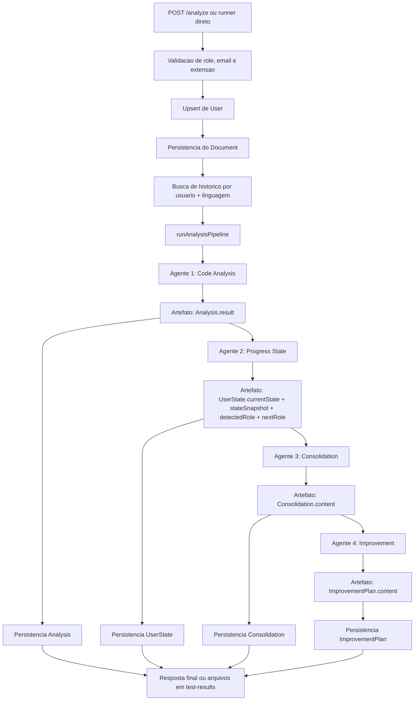

# Architecture Overview

## Objetivo

Esta aplicacao recebe um arquivo de codigo, identifica a linguagem, considera a senioridade esperada do desenvolvedor e executa um pipeline de analise com agentes internos para:

1. analisar o codigo atual
2. entender o estado atual do desenvolvedor com base na analise atual e no historico
3. consolidar a evolucao observada entre ciclos
4. gerar um plano pratico de evolucao

O sistema tambem possui uma trilha automatizada de testes de progressao para comparar comportamento por linguagem, por modelo e por provedor de LLM.

## Linguagens suportadas

- `Java` via `.java`
- `TypeScript` via `.ts`
- `React` via `.jsx` e `.tsx`

## Senioridades suportadas

- `Junior`
- `Pleno`
- `Senior`

A configuracao de roles, aliases e progressao fica em [roleConfig.js](../config/roleConfig.js).
As metricas estruturadas e referencias de maturidade por linguagem ficam em [evaluationFramework.js](../config/evaluationFramework.js).

## Visao de alto nivel

## Linha historica de decisoes arquiteturais

- [ADR-001](./adr-001-persistencia-estruturada-com-mongo.md): persistencia estruturada com Mongo
- [ADR-002](./adr-002-suporte-multilinguagem-java-typescript-react.md): suporte multilinguagem
- [ADR-003](./adr-003-regua-configuravel-por-senioridade-e-linguagem.md): regua configuravel por senioridade e linguagem
- [ADR-004](./adr-004-separacao-do-diagnostico-em-user-state-e-improvement-plan.md): separacao de `UserState` e `ImprovementPlan`
- [ADR-005](./adr-005-agente-de-consolidacao-para-historico-de-evolucao.md): agente de consolidacao
- [ADR-006](./adr-006-structured-evaluation-para-reduzir-subjetividade.md): structured evaluation
- [ADR-007](./adr-007-senior-file-scope-for-tcc.md): senior proporcional a amostra isolada no TCC
- [ADR-008](./adr-008-abstracao-de-provedor-para-openai-anthropic-e-gemini.md): abertura para multiplos provedores de LLM

## Framework estruturado de avaliacao

Para reduzir subjetividade, a avaliacao passa a contar com 3 componentes complementares:

1. rubrica explicita por senioridade
2. artefato estruturado por agente
3. classificacao numerica com gates minimos

Detalhamento completo:
- [structured-evaluation.md](./structured-evaluation.md)

Arquivos-base:
- [evaluationFramework.js](../config/evaluationFramework.js): criterios, pesos, bandas e gates
- [codeAnalysisArtifact.js](../services/evaluation/codeAnalysisArtifact.js): contrato do artefato estruturado
- [classifyDeveloperLevel.js](../services/evaluation/classifyDeveloperLevel.js): classificacao numerica e verificacao de gates

## Fluxo da rota

A rota principal esta em [analyze.js](../routes/analyze.js).

Ela executa este fluxo:

1. valida `userEmail`
2. resolve a `role`: usa a enviada na request ou a ja salva no usuario
3. valida a extensao do arquivo enviado
4. faz upsert do usuario pelo email
5. le o arquivo e salva um `Document`
6. busca a ultima `Analysis` do mesmo usuario e linguagem
7. executa o pipeline de agentes
8. salva a nova `Analysis`
9. salva o `UserState`
10. salva a `Consolidation`
11. salva o `ImprovementPlan`
12. retorna tudo no payload

O mesmo pipeline tambem pode ser executado pelo runner de testes em `modo direto`, sem passar pela rota HTTP, para reduzir gargalos de timeout em provedores mais lentos.

## Agentes internos

### 1. Agente de Analise de Codigo

Arquivo: [codeAnalysisAgent.js](../services/agents/codeAnalysisAgent.js)

Responsabilidade:
- analisar somente o codigo atual
- nao comparar com historico
- avaliar aderencia ao nivel esperado

Saida:
- texto tecnico detalhado salvo em `Analysis.result`
- artefato estruturado `ARTIFACT_JSON`, previsto em [codeAnalysisArtifact.js](../services/evaluation/codeAnalysisArtifact.js)

Modelo atual padrao:
- depende do provedor configurado
- override por `CODE_ANALYSIS_MODEL`

### 2. Agente de Estado do Desenvolvedor

Arquivo: [progressStateAgent.js](../services/agents/progressStateAgent.js)

Responsabilidade:
- comparar a analise atual com a anterior, quando existir
- descrever o estado atual do desenvolvedor
- apontar melhorias percebidas, lacunas e prontidao
- comparar o cargo atual com o proximo nivel possivel para avaliar prontidao de promocao

Saida:
- texto diagnostico salvo em `UserState.currentState`
- `stateSnapshot`, retornado no payload
- `detectedRole`, salvo em `UserState.detectedRole`
- `nextRole`, salvo em `UserState.nextRole`, representando o proximo nivel avaliado

Modelo atual padrao:
- depende do provedor configurado
- override por `PROGRESS_STATE_MODEL`

### 3. Agente de Consolidacao

Arquivo: [consolidationAgent.js](../services/agents/consolidationAgent.js)

Responsabilidade:
- comparar o estado atual com o estado anterior do desenvolvedor
- usar o plano de melhoria anterior como contexto de execucao
- consolidar evolucoes reais, lacunas recorrentes e sinais de aderencia ao plano anterior

Saida:
- texto consolidado salvo em `Consolidation.content`

Modelo atual padrao:
- depende do provedor configurado
- override por `CONSOLIDATION_AGENT_MODEL`

### 4. Agente de Melhoria

Arquivo: [improvementAgent.js](../services/agents/improvementAgent.js)

Responsabilidade:
- receber o estado atual do desenvolvedor
- receber o consolidado de evolucao
- gerar plano pratico de evolucao
- definir prioridades, metas, referencias e passos para o proximo nivel

Saida:
- texto de melhoria salvo em `ImprovementPlan.content`

Modelo atual padrao:
- depende do provedor configurado
- override por `IMPROVEMENT_AGENT_MODEL`

## Orquestracao da pipeline

O pipeline esta em [openaiService.js](../services/openaiService.js).

Ele orquestra os 4 agentes nesta ordem:

1. `runCodeAnalysisAgent`
2. `runProgressStateAgent`
3. `runConsolidationAgent`
4. `runImprovementAgent`

Hoje o passo `runCodeAnalysisAgent` ja produz o artefato estruturado antes da narrativa. Os agentes seguintes usam esse resultado como base principal de leitura do estado atual e do historico.

## Camada de LLM

O ponto de abstracao atual esta em [textGenerationClient.js](../services/llm/textGenerationClient.js).

Responsabilidades dessa camada:

- resolver o provedor atual por `LLM_PROVIDER`
- resolver o modelo efetivo por agente
- chamar OpenAI ou Anthropic
- preparar o terreno para futura integracao com Gemini

Provedores considerados hoje:

- `openai`
- `anthropic`
- `gemini`

## Modos de execucao de teste

O runner esta em [runProgressionTests.js](../scripts/runProgressionTests.js).

Ele suporta dois modos:

- `api`: chama `POST /analyze`
- `direct`: executa a mesma pipeline diretamente, persistindo os mesmos modelos Mongo sem passar pelo HTTP local

Variaveis uteis:

- `TEST_RUN_MODE`
- `TEST_TRACKS`
- `TEST_RUN_LABEL`
- `TEST_RUN_SEQUENCE`
- `TEST_INCLUDE_MODEL_IN_RUN_ID`

## Persistencia dos resultados de teste

Os resultados de bateria ficam em `project/test-results/<provider>/<modelo>/<tentativa>/`.

Exemplos de estrutura:

- `project/test-results/open-ai/gpt-4.1/primeira tentativa/`
- `project/test-results/anthropic/claude-sonnet-4-5-20250929/primeira tentativa/`
- `project/test-results/gemini/gemini-3.5-flash/primeira tentativa/`

Cada tentativa contem:

- `raw/`
- `reports/`
- `summary.json`
- `summary.csv`

## Models atuais

### User

Arquivo: [User.js](../models/User.js)

Campos principais:
- `externalId`
- `name`
- `email`
- `role`

### Document

Arquivo: [Document.js](../models/Document.js)

Campos principais:
- `userId`
- `name`
- `extension`
- `language`
- `content`

### Analysis

Arquivo: [Analysis.js](../models/Analysis.js)

Campos principais:
- `userId`
- `documentId`
- `language`
- `comparedToAnalysisId`
- `result`

### UserState

Arquivo: [UserState.js](../models/UserState.js)

Campos principais:
- `userId`
- `language`
- `role`
- `basedOnAnalysisId`
- `previousAnalysisId`
- `currentState`
- `detectedRole`
- `nextRole`

### ImprovementPlan

Arquivo: [ImprovementPlan.js](../models/ImprovementPlan.js)

Campos principais:
- `userId`
- `language`
- `role`
- `basedOnAnalysisId`
- `basedOnUserStateId`
- `basedOnConsolidationId`
- `nextRole`
- `content`

### Consolidation

Arquivo: [Consolidation.js](../models/Consolidation.js)

Campos principais:
- `userId`
- `language`
- `role`
- `basedOnUserStateId`
- `previousUserStateId`
- `previousImprovementPlanId`
- `content`

## Arquivos importantes

- [app.js](../app.js): bootstrap da API e conexao com Mongo
- [analyze.js](../routes/analyze.js): endpoint principal
- [roleConfig.js](../config/roleConfig.js): aliases, roles suportadas e ordem de progressao
- [evaluationFramework.js](../config/evaluationFramework.js): criterios, pesos, bandas e gates minimos
- [codeAnalysisArtifact.js](../services/evaluation/codeAnalysisArtifact.js): estrutura padrao do artefato do agente de analise
- [classifyDeveloperLevel.js](../services/evaluation/classifyDeveloperLevel.js): classificador objetivo de senioridade
- [textGenerationClient.js](../services/llm/textGenerationClient.js): abstracao atual de provedor/modelo
- [requestLogget.js](../middleware/requestLogget.js): logging por request
- [logUtils.js](../utils/logUtils.js): utilitarios de request id
- [runProgressionTests.js](../scripts/runProgressionTests.js): bateria automatizada de progressao

## Formato esperado da request

Endpoint:
- `POST /analyze`

Body multipart:
- `file`: arquivo `.java`, `.ts`, `.jsx` ou `.tsx`
- `userEmail`: email do usuario, usado como identidade principal
- `role`: opcional para usuarios ja cadastrados; obrigatoria para usuarios novos. Valores: `Junior`, `Pleno` ou `Senior`
- `userName`: opcional
- `externalId`: opcional, identificador externo do usuario

## Resposta atual

O endpoint retorna:
- `user`
- `document`
- `appliedRole`
- `analysis`
- `userState`
- `consolidation`
- `improvementPlan`

## Decisoes importantes tomadas

- A comparacao de historico acontece por `usuario + linguagem`
- O usuario e identificado principalmente por `userEmail`
- A `role` da request e opcional quando o usuario ja existe e tem `role` salva
- A `role` representa o cargo atual do usuario, nao necessariamente o limite da avaliacao
- O `nextRole` representa o proximo nivel usado como referencia de promocao
- O Agente de Progresso nao gera plano de metas; ele gera apenas diagnostico de estado
- O Agente de Consolidacao interpreta evolucao entre estados e o plano anterior antes de um novo plano ser gerado
- O Agente de Melhoria e o unico responsavel pelo plano pratico de evolucao
- O plano de melhoria passa a ser gerado a partir do estado atual mais do consolidado de evolucao
- Para o contexto do TCC, a leitura de `Senior` em amostras isoladas foi tornada proporcional ao escopo do arquivo. Justificativa em [adr-007-senior-file-scope-for-tcc.md](./adr-007-senior-file-scope-for-tcc.md)
- A comparacao entre provedores passou a ser uma preocupacao arquitetural explicita. Justificativa em [adr-008-abstracao-de-provedor-para-openai-anthropic-e-gemini.md](./adr-008-abstracao-de-provedor-para-openai-anthropic-e-gemini.md)
